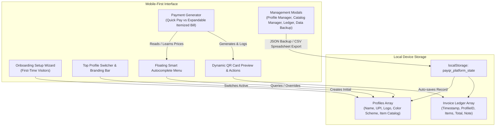

# 🏗️ Implementation Plan — PayQR Platform Transformation (v2)

## Goal Description
Transform PayQR from a single-profile QR generator into an **Offline-First, Mobile-Optimized Multi-Profile Merchant & Freelancer Payment Platform** using pure HTML5, vanilla JavaScript, and modern vanilla CSS. The upgrade enables onboarding wizards, profile switching, expandable itemized invoice building, self-learning item catalogs with smart autocomplete, custom logo injection, curated swatch color theming, automated transaction ledgers with revenue tracking, and complete JSON/CSV data portability.

### Key Architectural Objectives:
- **Mobile-First & Touch-Optimized:** All controls, drawers, and floating suggestion menus must follow thumb-friendly ergonomics (minimum 48x48px tap targets) and smooth responsive reflowing on small viewports.
- **Zero Server / Complete Privacy:** All state, images (as base64 Data URIs), learned catalogs, and transaction ledgers reside locally on-device via localStorage/IndexedDB with offline service worker support.

---

## User Review Required
> [!IMPORTANT]
> **Data Structure Migration:** We will transition storage from the simple key `payqr_profile` to a structured state object under `payqr_platform_state`. When the app loads, an automated backward-compatibility migration script will smoothly transform any legacy profile into the "Default Profile" within the new platform state without any data loss.

> [!TIP]
> **Image Storage Optimization:** To prevent `localStorage` quotas (~5MB) from being exceeded by massive image uploads, uploaded logos will automatically be compressed and resized via an offline HTML5 Canvas helper to a crisp 180x180 base64 PNG before being saved into profile data.

---

## Open Questions
All design questions and workflow preferences were completely resolved during our interactive `/grill-me` session. There are no pending open questions.

---

## Architecture & Data Flow



---

## Proposed Changes

### Component 1: Core State & Onboarding Engine
#### [MODIFY] `app.js`
- Define standardized platform data schemas and backward-compatible storage migration.
- Implement onboarding welcome wizard modal for first-time visitors when `profiles.length === 0`.
- Create active profile switching logic in the header bar.

```javascript
// New State Model
const defaultPlatformState = {
  activeProfileId: 'prof_default',
  profiles: [
    {
      id: 'prof_default',
      label: 'Store Checkout',
      name: 'Merchant Name',
      upiId: 'merchant@upi',
      themeColor: '#00B86B', // Default UPI Green
      logoDataUri: null,     // Base64 Logo
      catalog: {             // Smart learned item dictionary
        "Filter Coffee": { price: 30, count: 5 }
      }
    }
  ],
  ledger: [] // Historical invoices log
};
```

---

### Component 2: Expandable Itemized Billing & Smart Autocomplete Catalog
#### [MODIFY] `index.html`
#### [MODIFY] `app.js`
#### [MODIFY] `styles.css`
- Add expandable toggle `"+ Add Itemized Breakdown"` directly beneath standard Amount & Note inputs.
- Implement multi-row invoice table builder (*Item Name, Unit Price, Quantity, Row Total, Remove button*).
- Auto-sync and lock the primary Amount input when Itemized Mode is expanded.
- Implement custom floating autocomplete list underneath Item Name input that displays matching items and saved price tags (`☕ Latte [₹150]`).
- Implement automatic item learning and price overriding upon invoice generation.
- Add `"📦 Manage Catalog"` tab inside Profile Settings to edit or remove learned items.

```diff
+ // Autocomplete selection handler
+ function selectCatalogItem(rowId, itemKey) {
+   const activeProf = getActiveProfile();
+   const itemData = activeProf.catalog[itemKey];
+   if (itemData) {
+     const row = document.getElementById(`item_row_${rowId}`);
+     row.querySelector('.item-name-input').value = itemKey;
+     row.querySelector('.item-price-input').value = itemData.price;
+     updateItemizedTotals();
+     closeAutocompletePopup();
+   }
+ }
```

---

### Component 3: Custom Branding & Logo Injection
#### [MODIFY] `index.html`
#### [MODIFY] `styles.css`
#### [MODIFY] `app.js`
- Integrate file uploader for central logo embedding inside Profile Settings with auto-canvas compression.
- Implement visual swatch picker for curated palettes:
  - **UPI Green:** `#00B86B`
  - **PhonePe Purple:** `#5f259f`
  - **GPay Blue:** `#1a73e8`
  - **Luxury Gold:** `#d4af37`
  - **Elegant Slate:** `#475569`
- Allow custom Hex color picker option.
- Dynamically apply selected theme color to UI buttons, on-screen card borders, badges, and QR corner squares.
- Embed custom logo into the center of `QRCodeStyling` configuration and render onto `getCompositeCanvas()` downloads.

```javascript
// Dynamic QR generation with custom profile branding
currentQR = new QRCodeStyling({
  width: 260, height: 260,
  data: upiUrl,
  image: activeProfile.logoDataUri || null,
  imageOptions: {
    crossOrigin: 'anonymous',
    margin: 6,
    imageSize: 0.35
  },
  dotsOptions: { color: '#1a1a2e', type: 'rounded' },
  cornersSquareOptions: { color: activeProfile.themeColor || '#00B86B', type: 'extra-rounded' },
  cornersDotOptions: { color: activeProfile.themeColor || '#00B86B', type: 'dot' }
});
```

---

### Component 4: Recent Invoice Ledger & Revenue Analytics
#### [MODIFY] `index.html`
#### [MODIFY] `app.js`
- Create a slide-out drawer or modal for **"Recent Invoices Ledger"**.
- Automatically record every generated invoice with timestamp, profile ID, items array, total amount, and note.
- Render daily accumulated total revenue metrics at the top of the ledger screen.
- Provide a one-tap **"🔄 Reopen / Duplicate"** action that repopulates the dashboard form with historical invoice items for instant reissue.

---

### Component 5: Data Portability (JSON Backup & CSV Spreadsheet Export)
#### [MODIFY] `index.html`
#### [MODIFY] `app.js`
- Implement a centralized **"Data & Backup"** dashboard accessible via navigation icon.
- **Full JSON Backup:** One-click download of the complete `payqr_platform_state` as a timestamped file (`PayQR_Backup_2026-07-31.json`) and file input to restore backups seamlessly.
- **CSV Accounting Export:** One-click utility that iterates over the Invoice Ledger and downloads a neatly formatted spreadsheet (`PayQR_Invoices.csv`) with columns:
  `Invoice Date, Profile Name, UPI ID, Transaction Note, Itemized Summary, Grand Total (INR)`

```javascript
function exportLedgerToCSV() {
  const headers = ['Invoice Date', 'Profile Name', 'UPI ID', 'Note', 'Itemized Summary', 'Total Amount (INR)'];
  const rows = platformState.ledger.map(entry => [
    new Date(entry.timestamp).toLocaleString('en-IN'),
    `"${entry.profileName}"`,
    entry.upiId,
    `"${entry.note || ''}"`,
    `"${entry.items ? entry.items.map(i => `${i.qty}x ${i.name} (@₹${i.price})`).join('; ') : 'Lump Sum'}"`,
    entry.totalAmount
  ]);
  const csvContent = "data:text/csv;charset=utf-8," + [headers.join(','), ...rows.map(e => e.join(','))].join('\n');
  const encodedUri = encodeURI(csvContent);
  const link = document.createElement('a');
  link.setAttribute('href', encodedUri);
  link.setAttribute('download', `PayQR_Ledger_${new Date().toISOString().split('T')[0]}.csv`);
  document.body.appendChild(link);
  link.click();
  link.remove();
}
```

---

### Component 6: PWA Cache Upgrade & Mobile Ergonomics
#### [MODIFY] `sw.js`
- Bump cache name from `'payqr-v6'` to `'payqr-platform-v1'`.
- Ensure all new icons, modals, and helper utilities are covered under offline caching.

---

## Verification Plan

### Automated Tests
* Since this project is a purely static client-side web application without a Node/npm testing harness, validation will rely entirely on live JavaScript browser execution via our active HTTP server and structural inspection.
* We will verify proper syntax and absence of runtime exceptions in standard browser environments.

### Manual Verification Instructions
1. **Onboarding & Migration:**
   - Refresh `http://localhost:8080`. Verify that existing profile data automatically transforms into the default profile without data loss, or test clear storage to observe the first-time welcome wizard modal.
2. **Itemized Billing & Autocomplete Memory:**
   - Expand the **"+ Add Itemized Breakdown"** section. Add `2x Espresso @ ₹150` and `1x Cake @ ₹200`. Verify that the main amount auto-calculates to `₹500`.
   - Submit the bill. Clear inputs and type `"Esp"` in the item box. Verify that the floating autocomplete list prompts `"☕ Espresso [₹150]"`.
   - Select it, override price to `₹160`, submit, and verify that the catalog remembers `₹160` on subsequent inputs.
3. **Custom Branding & Logo:**
   - Open Profile Settings. Choose **PhonePe Purple** swatch (`#5f259f`) and upload a test logo image.
   - Generate a QR code and confirm the logo sits centered inside the QR pattern and all accents/cards appear in purple on screen and on the downloaded PNG file.
4. **WhatsApp Receipt Formatting:**
   - Click **Share on WhatsApp** and verify the message text includes the clean bulleted invoice item list above payment instructions.
5. **Invoice Ledger & Data Portability:**
   - Open **Recent Invoices Ledger**, review daily accumulated revenue, and tap **🔄 Duplicate** on a saved bill to repopulate the inputs.
   - Open **Data & Backup**, export the complete workspace `.json`, and download the accounting `.csv` spreadsheet to open in Excel/spreadsheet viewers.
